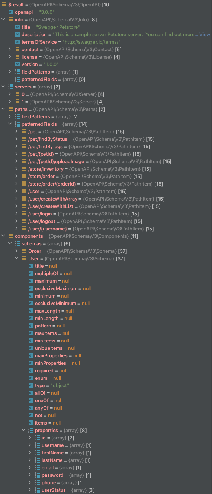

# PHP OpenAPI (Swagger) parser 

A universal OpenAPI (V3) or Swagger (V2) schema parser to convert OpenAPI/Swagger files into PHP object for 
programming use.

### Installing

```
composer require-dev allansun/openapi-parser
```


## Usage

This project is used for 'dev' environment only. It does not generate/provide any codes for run-time environment.

To start

```php
<?php

    use OpenAPI\OpenAPIParser;
    
    $Parser = new OpenAPIParser();
    
    $Swagger = $Parser->parse(json_decode(file_get_contents('openapi.json'), true));
```

Or to parse the legacy Swagger version 

```php
<?php

    use OpenAPI\SwaggerParser;
    
    $Parser = new SwaggerParser();
    
    $Swagger = $Parser->parse(json_decode(file_get_contents('swagger.json'), true));
```

The result would be:




## Contributing

Please read [CONTRIBUTING.md](https://gist.github.com/PurpleBooth/b24679402957c63ec426) for details on our code of 
conduct, and the process for submitting pull requests to us.

## Versioning

We use [SemVer](http://semver.org/) for versioning. For the versions available, see the 
[tags on this repository](https://github.com/your/project/tags). 

## Authors

* **Allan Sun** - *Initial work* - [AllanSun](https://github.com/allansun)

See also the list of [contributors](https://github.com/allansun/openapi-parser/contributors) who participated in this 
project.

## License

This project is licensed under the MIT License - see the [LICENSE.md](LICENSE.md) file for details

